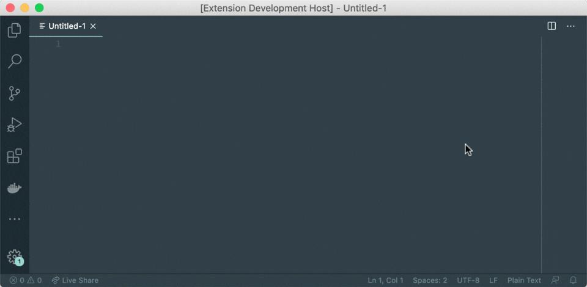
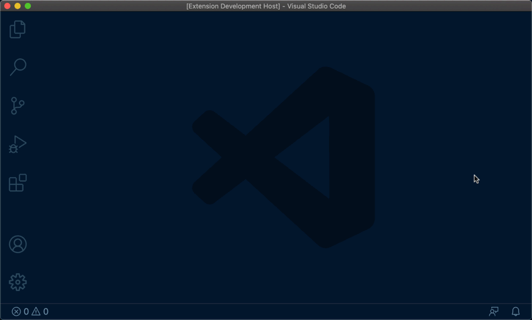
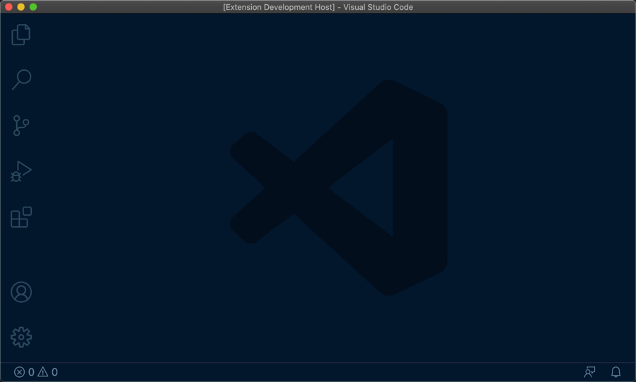
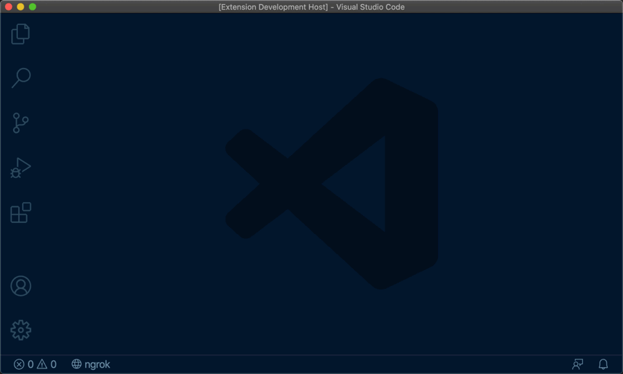

  
  <h1>ngrok for vscode</h1>
  
<em>A VSCode extension for controlling <a href="https://ngrok.com/">ngrok</a> from the command palette.</em>

  

    
    
  

## Features

- `ngrok: start`: Start an HTTP tunnel pointing to a port of your choice from the command palette

  

  You can choose to copy the URL to the clipboard, open it in a browser or even generate a QR code so that you can easily open it on a mobile device

  

- `ngrok: start`: Start a named HTTP tunnel from your ngrok config

  

- `ngrok: stop`: Stop one or all HTTP tunnels

  

- `ngrok: dashboard`: Open the ngrok dashboard

## Extension Settings

This extension contributes the following settings:

- `ngrokForVSCode.configPath`: set a custom path to your ngrok config

## Release Notes

### [1.8.0](https://github.com/philnash/ngrok-for-vscode/compare/v1.7.0...1.8.0) - 2020-12-31

#### Added

- Shows the currently running version of the ngrok binary in the status bar

#### Changed

- Updates ngrok npm module

See the [CHANGELOG](CHANGELOG.md) for all release notes.

## Contributors

### Author

**Phil Nash** - [GitHub](https://github.com/philnash) • [Website](https://philna.sh) • [Twitter](https://twitter.com/philnash)

### Other contributors

- **Michał Mrozek** - [GitHub](https://github.com/Michsior14)
- **Zack Radisic** - [GitHub](https://github.com/zackradisic)

### Thanks

Thanks go to:

- [Alan Shreve](https://github.com/inconshreveable) and [contributors](https://github.com/inconshreveable/ngrok/graphs/contributors) for [ngrok](https://ngrok.com)
- [Alex Bubenshchykov](https://github.com/bubenshchykov) and [contributors](https://github.com/bubenshchykov/ngrok/graphs/contributors) for the [Node.js wrapper for ngrok](https://github.com/bubenshchykov/ngrok).
